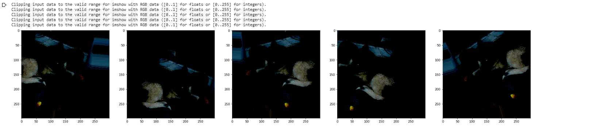

## **STANDFORD DOG DATASETS**
### **Introduction**
- Dataset has 20,580 dogs images in 120 categories. In this project, i will use Google's Inception V3 model for multiclass image classification. Object is picking different categories of dog images for CNN model. After training, we will check the accuracy of the CNN model to predict the dog's categories. 

- By using Google Colab, i can access the library and package quickly and google colab calculate very fast. I load the datasets from Kaggle and use the pipeline to load to Google Colab
#### **1. Data Loading and Structure**
- Exploring the dataset to look at the classes/breeds of the dogs to understand more about its structure
  
- There are 120 subfolders, each belonging to 1 of the 120 dog breeds. For example, images of the Chow breed are under the subfolder n02107574-Greater_Swiss_Mountain_dog. We then proceed to extract the name of the dog breeds by splitting the folder name.

- Then, for each of the images, we get the full path to the image (stored in X), as well as its associated label/class/breed (stored in y). This allows us to load the images easily. 
-  I kept 20 % of the datasets to become a test set - 800 image augmented 

### **2. Suffle and Plot Images**
- Shuffle the images and their labels together so that they are not grouped by their breeds.
-  And look at a sample batch of the dog images with their associated labels. Notice that the images have different dimensions, so we will have to resize them later before putting them into the model. 

- Each image will has 120 columns with all but 1 column with a value of 0. The only column with a value of 1 is the image's associate class/breed/label.

### **3. Prepare data for training CNN model**
#### Data augmentation
- It's important to convert into the dimension that is similar. I decide to do data augmentation. 
- We can see that we have 2560 training, 640 validation,and 800 testing images. Each image has a 299x299 dimension, with 3 channels, representing the RGB channels.

-  Available transformations are: rotate, shift x and y, zoom in, shear.

- Below is an example of an image that was transformed into 'new' images. The model can then extract features from them and learn that these features are associated with this particular breed of dog.

### **4.Model Building**
- Classify using a neural network using only fully connected layers. It's not a very good tool to deal with images.
- The batch size is the number of images passed to the model for training during every iteration. Therefore, the number of iterations/steps is the number of images divided by the batch size, which constitues one epoch. After each iteration, weights of the nodes will be updated. An epoch ends when the entire dataset has been passed through. The more epoch we have, the more the model will train on the data..
  

- Using a batch size of 32 after only 20 epochs the model reach **85 %** accuracy on the test set. 
- Evolution of loss and accuracy looks good and show a converging model:
  

### **5.Prediction**
- Object is the model that can generalize to other datasets from the one we trained on. 
- The result of the label of dogs are good for 20 next data 

- Let's the project be more interesting by predict 30 random images and visualize the better performance. I plot a small batch of datasets :

## Conclusion

With this project and the course, i got a step by step in order to testing and training datasets.  This project has good prediction rate : **85%** and train 2560 images. The results are great to shows the powers of convolutional neural networks. 
